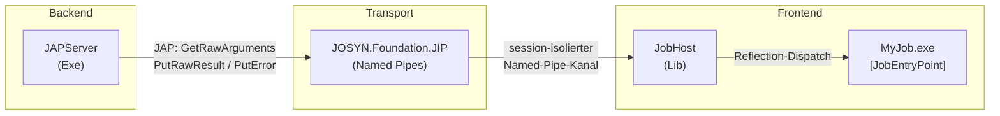
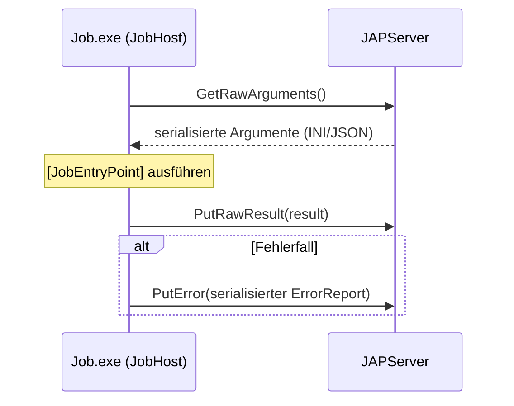
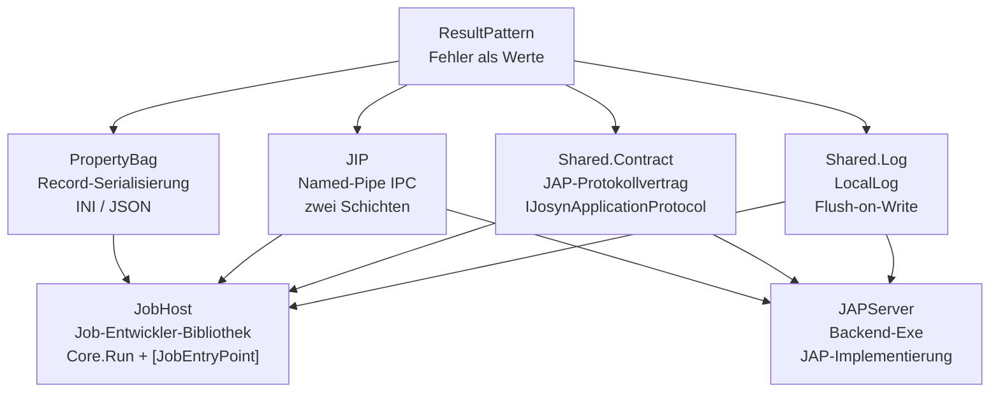

# JOSYN.POC

**JOSYN.POC** (JobSystem Next — Proof of Concept v2) ist ein **funktionales Job-Execution-System**
als Architektur-Showcase für **.NET 10 / C# latest**.

Der PoC ist end-to-end lauffähig. Alle NuGet-Pakete sind gepackt. Das Demo startet mit einem Befehl.

> Dieses Repository ist eine **physikalisches Multi-Repo** (mehrere logische Repos unter einem Root).
> Jedes logische Repo hat sein eigenes `.slnx`-Solution, `nuget.config` und `.local-build\`-Skripte.

---

## System-Überblick



### JAP-Protokoll (3 Aufrufe)



---

## Repository-Struktur

```
JOSYN.POC/
├── .github/                              ← Agent-Layer (Persona, Stories, Artifacts)
├── .local-build/                         ← Root-Orchestrierungs-Skripte
├── docs/                                 ← High-Level-Architecture.pptx + architecture-reference.md
├── Local Packages/                       ← Lokaler NuGet-Feed
│
├── JOSYN.Foundation/
│   ├── JOSYN.Foundation.ResultPattern/   [NuGet 1.0.0-preview01]  ← keine externen Deps
│   ├── JOSYN.Foundation.PropertyBag/     [NuGet 1.0.0-preview01]  ← depends: ResultPattern
│   └── JOSYN.Foundation.JIP/             [NuGet 1.0.0-preview01]  ← depends: ResultPattern
│
└── JOSYN.System/
    ├── JOSYN.System.Shared/
    │   ├── JOSYN.System.Shared.Contract/ [NuGet 1.0.0-preview01]  ← depends: ResultPattern
    │   └── JOSYN.System.Shared.Log/      [NuGet 1.0.0-preview01]  ← depends: ResultPattern
    ├── JOSYN.System.Frontend/
    │   ├── JOSYN.System.Frontend.JobHost/ [NuGet 1.0.0-preview01] ← depends: alle Foundation + Shared
    │   └── JOSYN.MyDemoJob/              ← Demo-Exe (nicht gepackt)
    └── JOSYN.System.Backend/
        └── JOSYN.System.Backend.JAPServer/ ← Backend-Exe (nicht gepackt)
```

---

## Bausteine auf einen Blick



| Baustein | Art | Zweck |
|---|---|---|
| `JOSYN.Foundation.ResultPattern` | NuGet-Lib | Fehler als Werte — kein `throw` über die Catch-Grenze hinaus |
| `JOSYN.Foundation.PropertyBag` | NuGet-Lib | `record`-Serialisierung zu INI oder JSON; Argumente und Ergebnisse über die Pipe |
| `JOSYN.Foundation.JIP` | NuGet-Lib | Named-Pipe-Transport (Bytes + JSON-Konventions-Layer) |
| `JOSYN.System.Shared.Contract` | NuGet-Lib | JAP-Vertrag — `IJosynApplicationProtocol` (3 Methoden) |
| `JOSYN.System.Shared.Log` | NuGet-Lib | `LocalLog` — prozess-lokaler Datei-Logger, nie werfend |
| `JOSYN.System.Frontend.JobHost` | NuGet-Lib | Job-Entwickler-Bibliothek — Bootstrapping, Dispatch via Reflection |
| `JOSYN.System.Backend.JAPServer` | Exe | Backend-Prozess — nimmt JAP-Aufrufe entgegen, startet Jobs |
| `JOSYN.MyDemoJob` | Exe | Demo-Job — ein `[JobEntryPoint]`, eine Zeile `Program.cs` |

---

## Demo ausführen

```
.local-build\demo.cmd
```

Startet JAPServer und MyDemoJob in separaten Konsolenfenstern (Release-Build).
Debug-Variante: `.local-build\demo.debug.cmd`

### Vollständiger Rebuild

```
.local-build\build-all.cmd
```

Crystal-Clean: leert NuGet-Cache und `Local Packages\`, baut und packt alle logischen Repos
in der richtigen Abhängigkeits-Reihenfolge.

### Alle Tests

```
.local-build\test-all.cmd
```

---

## Architektur-Prinzipien

| Prinzip | Umsetzung |
|---|---|
| Functional-first C# | `static class` als Default; `record` für Daten; OOP nur wenn gerechtfertigt |
| Immutability by default | `record` + `init`-Properties; mutable State explizit begründet |
| Fehler als Werte | `Result` / `Result<T>` — kein `throw` über die Catch-Grenze hinaus |
| Explicit over magic | Kein DI-Container; keine Reflection außer am definierten Erweiterungs-Punkt (JobInvoker) |
| Minimale Surface | Nur was gebraucht wird ist `public`; Interfaces in `Contracts/` als API-Dokumentation |

Fehlermeldungen sind bewusst auf **Deutsch** gehalten. Thread-Culture ist `de-DE`.

---

## Weiterführende Dokumentation

- [`docs/architecture-reference.md`](docs/architecture-reference.md) — vollständige technische Referenz aller Bausteine
- Einzelne Bausteine: README im jeweiligen Verzeichnis

---

*JOSYN.POC — © 2026 HAEVG AG — MIT License*